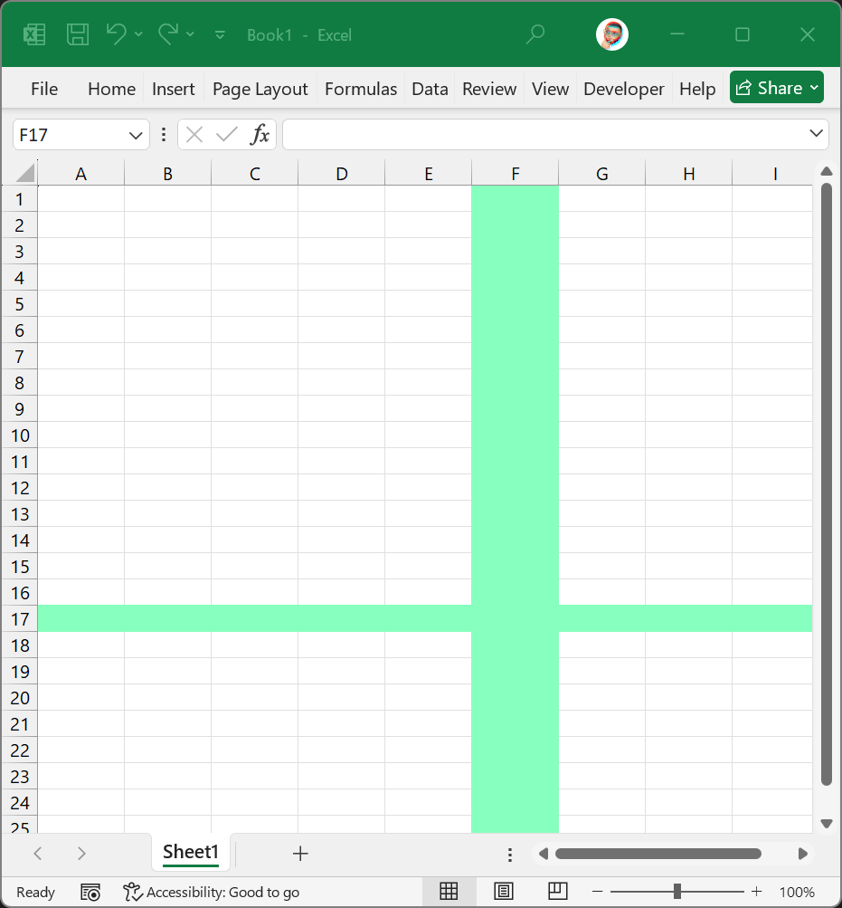
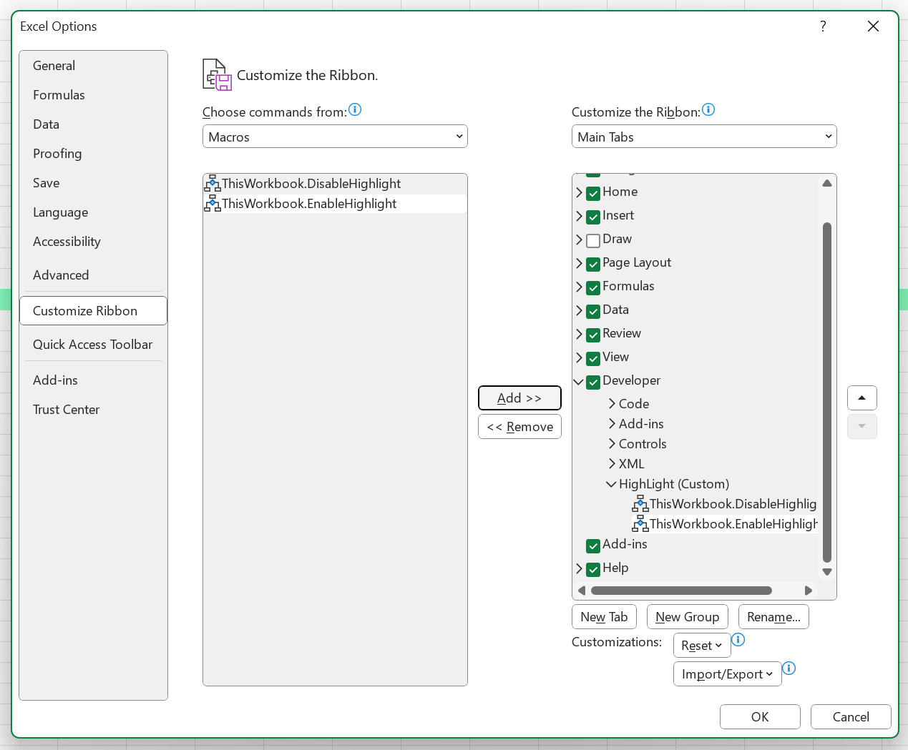

# Excel_Highlighter

## preview

## how to use 
### move file 
move `HighLighter.xlam`
to `C:\Users\<User>\AppData\Roaming\Microsoft\AddIns\`

### enable in excel
* Load it in Excel:
* Go to File > Options > Add-ins.
* Select Excel Add-ins from the dropdown at the bottom and click Go.
* Browse and load your Highlight.xlam file.

## enable ribbon controls in excel
* open Excel > File > Options > Customize Ribbon
* on the left, use the drop down for macos
* select them, click the "Add>>" button to move them to the right.
    * fill free to place them in any tab you want.  

    

## known issues 
`undo` doesn't work with this 